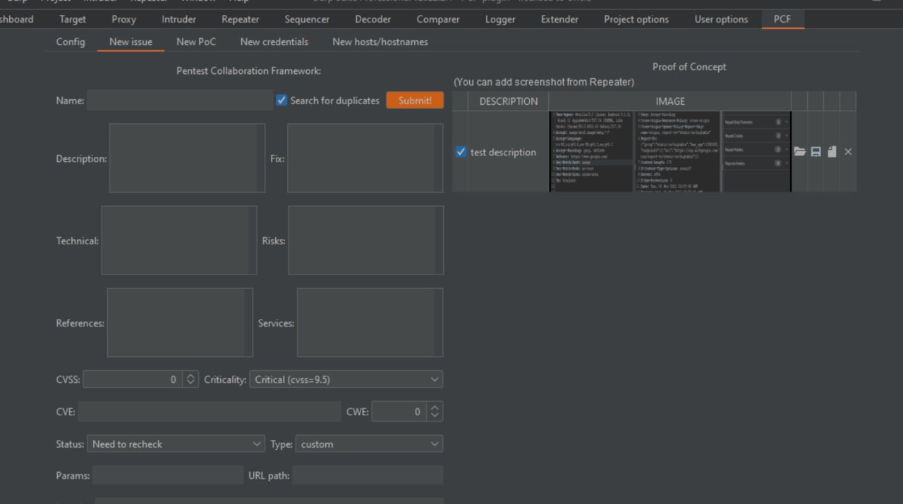
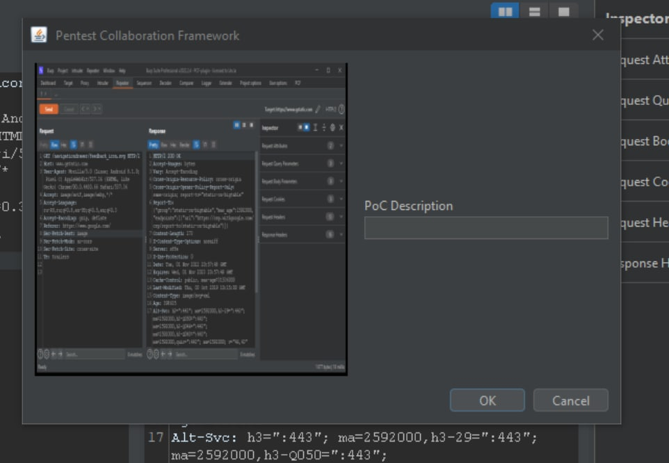
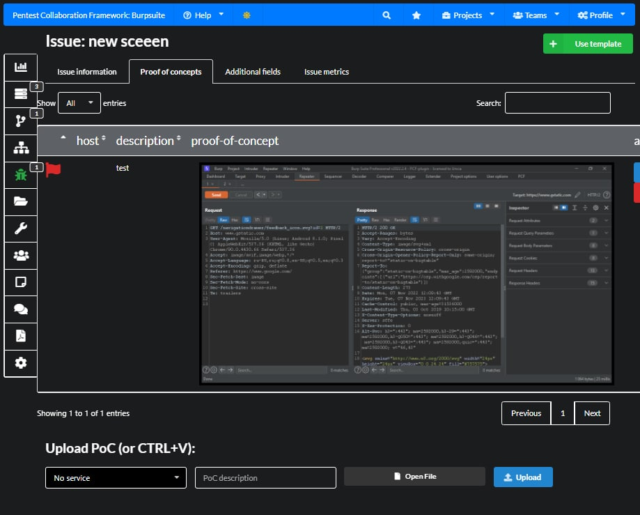

# Pentest Collaboration Framework: BurpSuite Extension

You can easily add following information from BurpSuite:

- Repeater screenshot -> Issue Proof-of-concept
- Repeater request -> Issue information
- Scan issue -> Issue information

Also you can make some fast actions:

- Fast issue in two clicks
- Fast issue + screenshot in two clicks

## Download link

[/releases/pcf.jar](https://gitlab.com/invuls/pentest-projects/pcf_tools/pcf-burpsuite-extention/-/raw/master/releases/pcf.jar?inline=false)

## Screenshots

### Fast Issue + PoC creation

### Repeater menu

### Scanner menu

### Issue creation tab

### Repeater screenshot -> Proof-of-concept

### Created issue with Proof-of-concept

